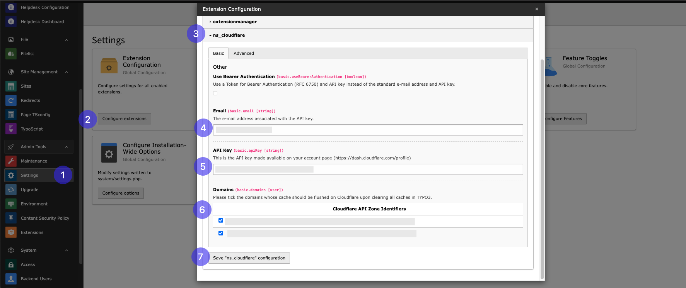
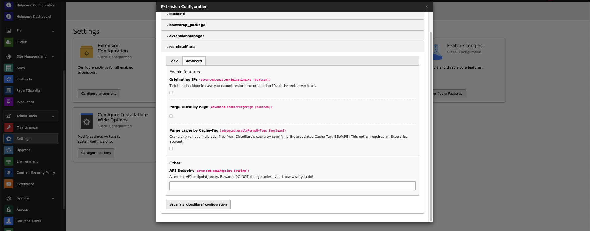
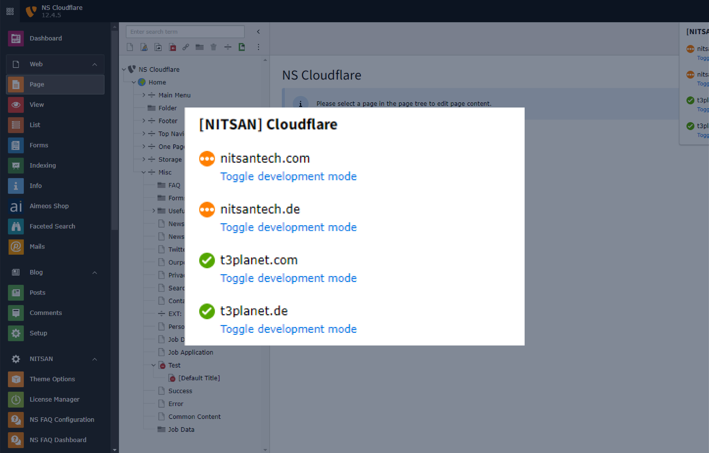
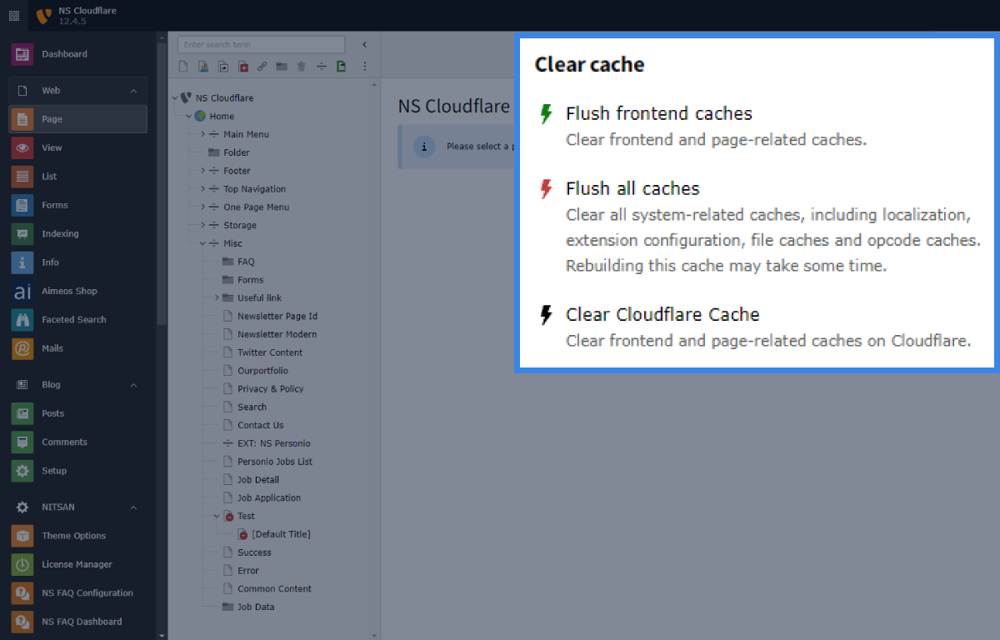
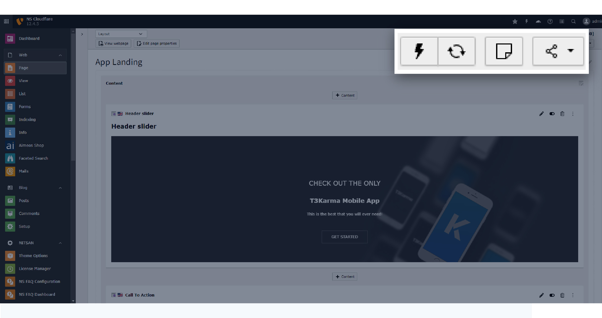

.. _configuration:

=============
Configuration
=============

Please follow below steps for configuration:

Basic Configuration Steps
=========================

#. Go to Settings
#. Click on configure extensions
#. Select ns_cloudflare
#. Add email address added while creating cloudflare account
#. Add API key
#. Select domain which you want to Enable for cloudflare
#. Click on "Save ns_cloudflare configuration"

For API key check this reference link for step by step guidance: https://developers.cloudflare.com/api/

Advanced Configuration
======================

**Originating IPs:** This checkbox allows you to restore the originating IPs.

**Purge cache by Page:** If this checkbox is enabled then, you can clear cloudflare cache by clearing page cache.

**Purge cache by cache-Tag:** This checkbox allows you to purge individual files on Cloudflare's cache using the associated Cache-Tag.

**API Endpoint:** An alternate API endpoint/proxy for Cloudflare.

Features
========

Development Mode Toggle
-----------------------

This allows easy toggling of development mode directly from the TYPO3 Backend.

TYPO3 Backend Cache Purge
--------------------------

This effortlessly manages TYPO3 website cache with our Cloudflare Extension.

Page-Specific Cache Purge
--------------------------

It clears cache for specific pages directly from the TYPO3 Backend.

