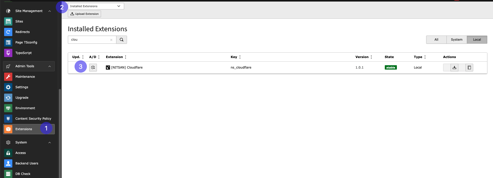

.. _installation:

============
Installation
============

The extension needs to be installed as any other extension of TYPO3 CMS. Get the
extension by one of the following methods:

#. **Use composer**: Run

   .. code-block:: bash

      composer req nitsan/ns-cloudflare --with-all-dependencies

   in your TYPO3 installation.

#. **Get it from the Extension Manager:** Switch to the module :guilabel:`Admin Tools > Extensions`.
   Switch to :guilabel:`Get Extensions` and search for the extension key
   *ns_cloudflare* and import the extension from the repository.

#. **Get it from typo3.org:** You can always get current version from `TER`_
   by downloading the zip version. Upload the file afterwards in the Extension
   Manager.

.. _TER: https://extensions.typo3.org/extension/ns_cloudflare/

Installation Steps
==================

Extension Installation Via Extension Manager
---------------------------------------------

1. Switch to the module "Extension Manager"
2. Get the extension
3. Get it from the Extension Manager: Press the "Retrieve/Update" button and search for the extension key ns_cloudflare and import the extension from the repository
4. Get it from typo3.org: You can always get the current version from https://extensions.typo3.org/extension/ns_cloudflare/ by downloading either the t3x or zip version. Upload the file afterwards in the Extension Manager

